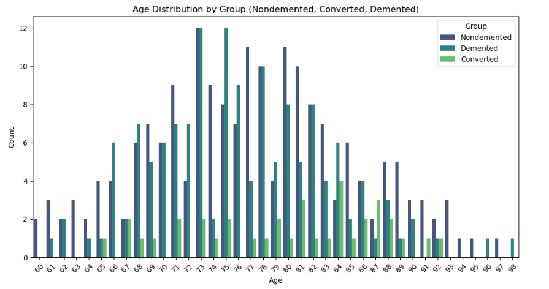
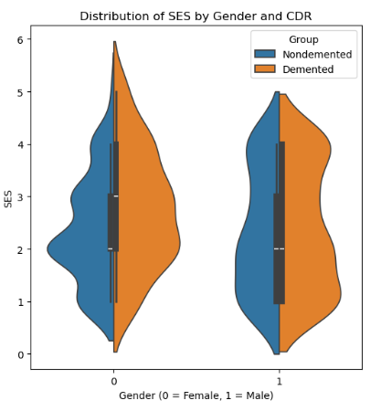
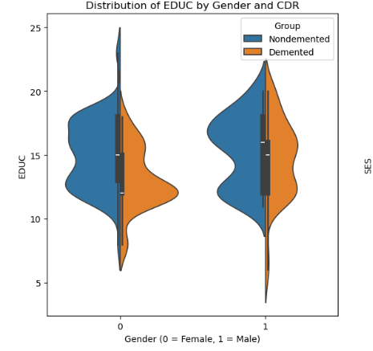

# Dementia Prediction App


This project is a web application designed to manage dementia based on some inputs. The app considers various factors such as age, gender, education level, socioeconomic status, MMSE score, brain volumes, and other related factors to make predictions about the likelihood of dementia.

## Table of Contents

- [Overview](#overview)
- [Features](#features)
- [Insights](#insights)
- [Visualizations](#visualizations)
- [Setup and Installation](#setup-and-installation)
- [Usage](#usage)
- [Code Snippets](#code-snippets)
- [About](#about)
- [Contributing](#contributing)
- [License](#license)

## Overview

The Dementia Prediction App utilizes a machine learning model trained on a dataset containing information about patients with and without dementia. The goal is to provide an accessible tool for early detection and better management of dementia.

## Features

- User-friendly web interface built with Streamlit.
- Input fields for various predictors such as age, gender, education level, socioeconomic status, MMSE score, brain volumes, etc.
- Visualization of data distributions and correlations.
- Real-time predictions based on user input.
- Information and resources about dementia.

## Insights

### Education Level (EDUC)
As we can observe from the plot, men with education levels between 10 and 17 have higher levels of dementia cases, and men start to show dementia symptoms with education levels as low as 4 years. In contrast, women start showing dementia symptoms after 6 years of education, with the highest peak at level 13.

### Socioeconomic Status (SES)
An intriguing pattern can be seen in the plot: for men, the highest peak is at 1, which corresponds to the highest status, and the lowest peak is at 4, corresponding to the lowest status. For women, the highest peak is at 2, with the lowest status cases reported between 1 and 5. According to this, women are less likely than men to experience dementia at both extremely high and extremely low socioeconomic class levels.

### MMSE (Mini-Mental State Examination Score)
The plot reveals that for both men and women, the highest peak is at 28, close to the best MMSE score, with men’s lowest peak at 10 and women’s at 12. This indicates that most men and women have strong cognitive function with MMSE scores around 28. However, men's scores can fall to 10, suggesting a broader range of cognitive deterioration compared to women.

### Estimated Total Intracranial Volume (eTIV)
The eTIV of demented females ranges from 1000 to 1850 with a peak at 1500, while for males, it ranges from 1200 to 2100. This implies that males tend to have a broader range of eTIV values and their peaks are slightly higher compared to females. This difference in eTIV distribution between genders could indicate variations in brain structure and volume related to dementia, suggesting the need for gender-specific approaches in understanding and treating the condition.

### Normalized Whole Brain Volume (nWBV)
The nWBV of demented males is high between 0.65 and 0.75. This difference indicates a variation in brain volume related to dementia between genders, suggesting different patterns of brain atrophy in men and women.

## Visualizations

Below are some visualizations included in the app:

### Age Distribution by Group



### SES Status and Gender Violin Plot

<p align="center">
  
  
</p>


## Setup and Installation

To run this project locally, follow these steps:

1. **Clone the repository:**
    ```bash
    git clone https://github.com/yourusername/dementia-prediction-app.git
    cd dementia-prediction-app
    ```

2. **Create and activate a virtual environment:**
    ```bash
    python -m venv venv
    source venv/bin/activate   # On Windows use `venv\Scripts\activate`
    ```

3. **Install the required dependencies:**
    ```bash
    pip install -r requirements.txt
    ```

4. **Run the Streamlit app:**
    ```bash
    streamlit run app.py
    ```

## Usage

1. Open your web browser and navigate to `http://localhost:8501`.
2. Use the input fields to enter the relevant information for dementia prediction.
3. Click the "Predict" button to see the prediction result.

## Code Snippets

### Data Preprocessing
```python
import pandas as pd
from sklearn.model_selection import train_test_split

# Load data
data = pd.read_csv('dementia_dataset.csv')

# Preprocess data
data['Group'] = data['Group'].map({'Nondemented': 0, 'Demented': 1})
X = data.drop(['Group'], axis=1)
y = data['Group']

# Split data
X_train, X_test, y_train, y_test = train_test_split(X, y, test_size=0.2, stratify=y, random_state=0)
